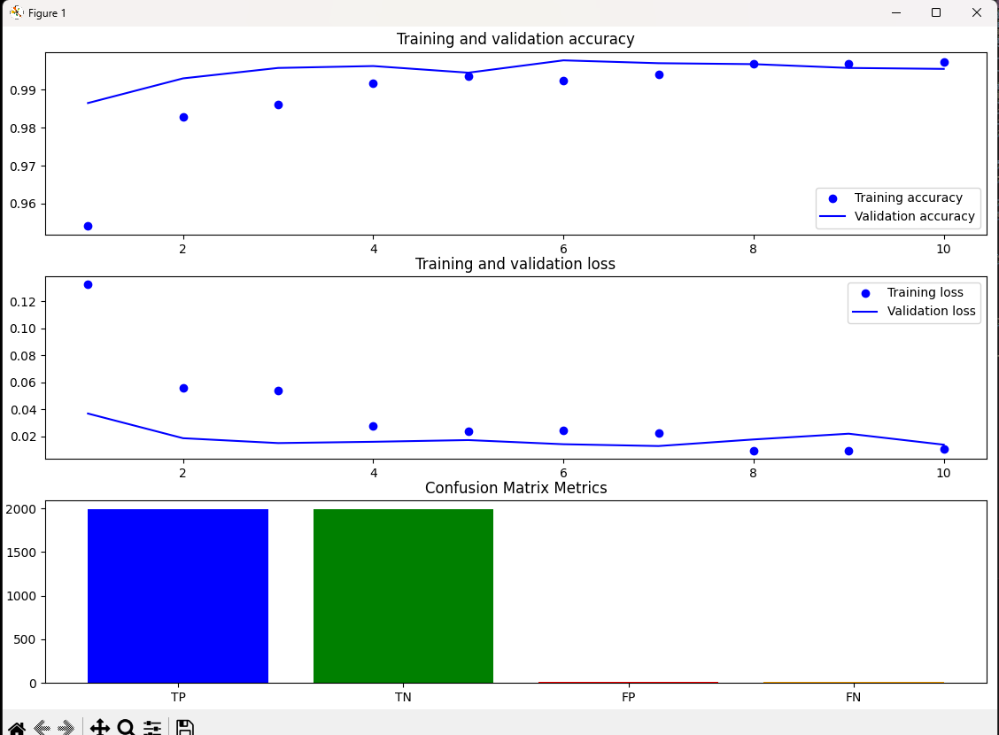
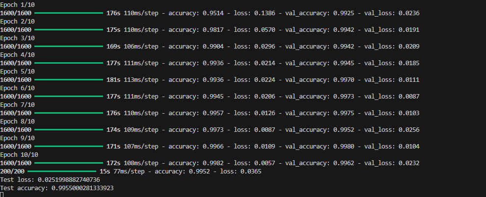
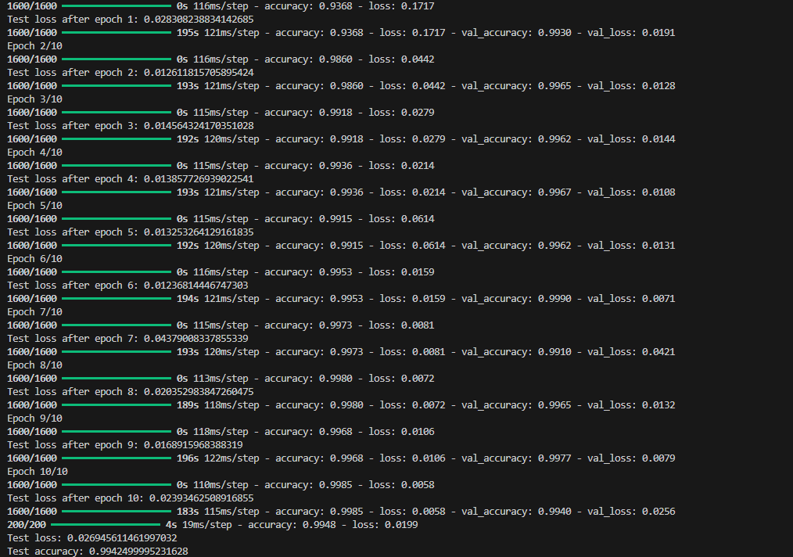
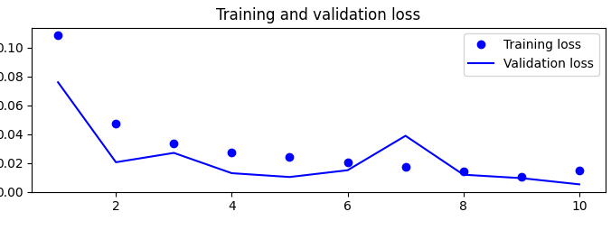
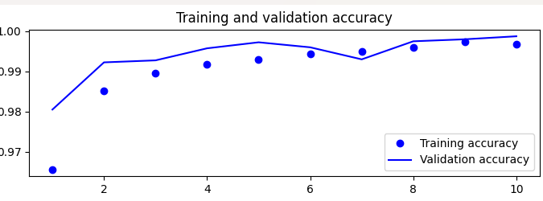
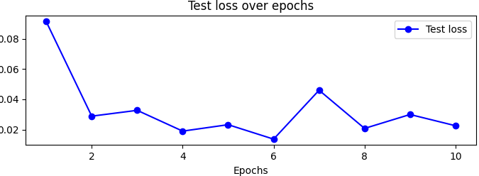

# Concrete Crack Classification
## TC3002B
### Renato Sebastian Ramírez Calva A01275401
## Descripción
El dataset seleccionado para el modelo consta de 40,000 imágenes en total, distribuido en 20k de concreto quebrado y 20k de concreto no quebrado. Estas imagenes fueron tomadas de varios edificio de campus de METU(Universidad Técnica de Medio Oriente) para su clasificación.
## Fuente
Las imágenes fueron adquiridas del dataset titulado [Concrete Crack Images for Classification de Kaggle](https://www.kaggle.com/datasets/arnavr10880/concrete-crack-images-for-classification?select=Negative). 
Este conjunto fue seleccionado por la cantidad de imagenes y su formato en su haber.

El dataset fue creado originalmente por el usuario ArnavR. El formato de las imagenes es jpg y todas cumplen con 277 x 277 pixeles.

## Dataset
El dataset original no está incluido en este repositorio. Sin embargo, se puede acceder desde este enlace de [Google Drive](https://drive.google.com/drive/folders/1esR6ZMOZ3Ljps-FKKPdS_Y1fAdb_qZ6E?ths=true).

Se dividieron las imagenes en dos carpetas: train, test. La carpeta train contiene 32000 imágenes, mientras que la carpeta test contiene 8000 imágenes. 

Las imagenes fueron renombradas acorde a su clasepara no tener problemas de uso. 

En su total hay 2 clases para las imagenes, POSITIVE Y NEGATIVE, POSITIVE refiere a imagenes donde se presenta una abertura de concreto, NEGATIVE apunta a imagenes donde el concreto esta intacto.

Se uso el prefijo 0000xT, donde x es el numero de la imagen y T el termino referente a la clase, ej: 00001P.jpg.

## Modelo
El modelo utilizado en este proyecto es una red neuronal convolucional (CNN), Las CNN son particularmente efectivas para tareas de clasificación de imágenes.

Las CNN están diseñadas con una arquitectura convolucional que imita el sistema visual humano. Esta arquitectura permite a las CNN extraer características jerárquicas de las imágenes.

Estas características les permiten extraer características relevantes de las imágenes de manera eficiente y precisa, incluso cuando las imágenes están sujetas a variaciones menores en términos de posición, orientación y tamaño.

## Arquitectura del Modelo
Se crea un modelo de tipo Sequential de Keras. Éste tipo de modelo apila capas una tras otra.

### Se agregan tres capas convolucionales Conv2D:

Cada capa tiene 32, 64 y 128 filtros respectivamente (estos filtros aprenden características de la imagen).

El tamaño del kernel de convolución es 3x3 pixeles en todas las capas.

Todas las capas usan la función de activación relu.

### Se agregan tres capas de pooling MaxPooling2D:

Estas capas reducen la dimensionalidad de la salida de las capas convolucionales tomando el valor máximo en un ventana de 2x2 pixeles.

Esto ayuda a controlar la sobrecarga de parámetros y a obtener características robustas a pequeñas variaciones en la imagen.

Se agrega una capa Flatten que transforma el tensor de salida de la última capa convolucional en un vector unidimensional. Esto es necesario para conectarlo a las capas densas.

### Se agregan dos capas densas Dense:

La primera capa tiene 512 neuronas y usa la función de activación relu.

La segunda capa tiene 1 neurona y usa la función de activación sigmoid.

## Resultados primera evaluacion
 [1] [2]

En la grafica la precisión del entrenamiento comienza alrededor del 98% y aumenta constantemente hasta más del 99,5%. 

La precisión de la validación comienza en alrededor del 97% y aumenta hasta alrededor del 99%. 

Esto sugiere que el modelo está funcionando bien y no está sobreajustado. Sin embargo, monitorear de cerca la precisión de la validación durante proximos entrenamiento seria buena idea para asegurarse de que el modelo no se sobreajuste.

En general, la imagen muestra que el modelo se ha entrenado con éxito. 

La precisión de entrenamiento y la precisión de validación son ambas altas, y la pérdida de entrenamiento y la pérdida de validación son ambas bajas. 

Esto sugiere que el modelo es capaz de aprender de los datos de entrenamiento y generalizarse bien a los datos nuevos.

## Resultados Segunda evaluacion

 [2]

 [2]

## Conclusiones 

La precisión de validación también aumenta a lo largo de las 10 épocas, pero no tan rápidamente como la precisión de entrenamiento. 

Esto es un buen signo, ya que sugiere que el modelo no está sobreajustándose a los datos de entrenamiento.

La pérdida de entrenamiento disminuye constantemente a lo largo de las 10 épocas. Esto es un buen signo, ya que sugiere que el modelo está aprendiendo a cometer menos errores.

En general, el modelo se ha entrenado con éxito. Sin embargo, estos son sólo los resultados del entrenamiento del modelo. 

Es importante evaluar el rendimiento del modelo en un conjunto de datos de prueba independiente para asegurarse de que se adapta bien a los datos nuevos.

## Referencias
[1]Wang, J., & Perez, L. (2017, December 01). The Effectiveness of Data Augmentation in Image Classification using Deep Learning. [https://arxiv.org/abs/1712.04621].

[2]Zhu, Z., Bian, Z.-P., Hou, J., Wang, Y., & Chau, L.-P. (2018). When Residual Learning Meets Dense Aggregation: Rethinking the Aggregation of Deep Neural Networks. [https://arxiv.org/abs/2004.08796].

[3]Szegedy, C., Liu, W., Jia, Y., Sermanet, P., Reed, S., Anguelov, D., ... & Rabinovich, A. (2015). Going deeper with convolutions. [https://arxiv.org/abs/1409.4842].

[4]Krizhevsky, A., Sutskever, I., & Hinton, G. E. (2012). Imagenet classification with deep convolutional neural networks.[https://proceedings.neurips.cc/paper_files/paper/2012/file/c399862d3b9d6b76c8436e924a68c45b-Paper.pdf]

